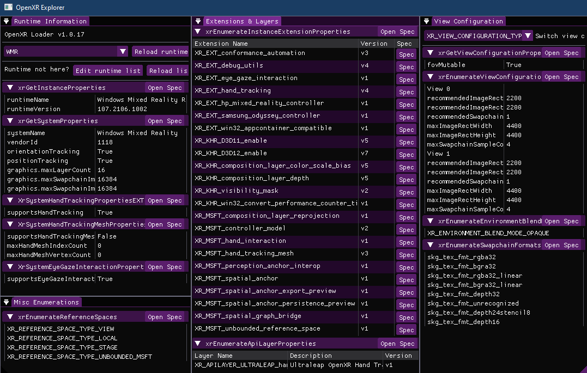
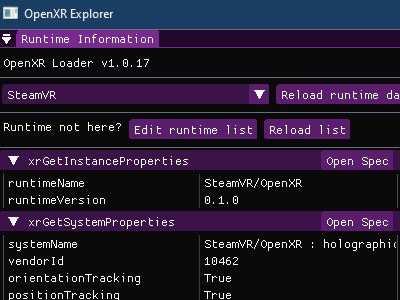
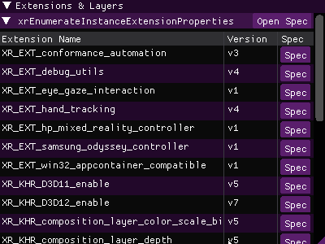
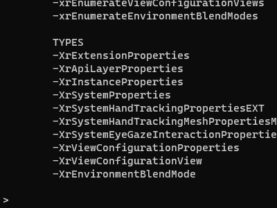

# OpenXR Explorer

OpenXR Explorer is a handy debug tool for OpenXR developers. It allows for easy switching between OpenXR runtimes, shows lists of the runtime's supported extensions, and allows for inspection of common properties and enumerations, with direct links to relevant parts of the OpenXR specification!

## Download
Get the latest pre-compiled binaries over in [the releases tab](releases)!

## Features
### Runtime Switching


If you hop between runtimes often, whether it be for testing, experimenting, or whatever else, you know it can be a bit painful! OpenXR Explorer adds a simple dropdown to manage this, with a configurable list of runtimes for those with in-development runtimes, or non-standard install directories. Permission elevation is requested via a separate switching application, so OpenXR Explorer itself doesn't need admin!

And speaking of a separate application, that application is `xrsetruntime`, and is easily accessible via command line for those with a CLI workflow! Try `xrsetruntime -WMR` from an elevated console.

### Runtime Information


It can be handy to know what to expect when requesting data from OpenXR! This tool shows all the common lists and enumerations, and provides quick links to the relevant section of the OpenXR specification for additional details. This is a great way to quickly see differences between runtimes, or plan out your own OpenXR applications!

### Command Line Interface


Just about everything you see in the GUI is also available in text format when used from the command line! If you provide the openxr-explorer application with function or type names as arguments, it'll just dump the results as text to the console instead of launching the GUI. Who needs this? I don't know! I sure didn't, but I hope someone else does :)

### Building
If you just want to use it, see the [Releases](releases) tab! If you want to build it or modify it, then OpenXR Explorer uses cmake.

#### Windows
From the root directory:
```
mkdir build
cd build
cmake ..
cmake --build . --config=Release
cd Release
openxr-explorer.exe
```
#### Linux
Coming soon... OpenXR Explorer was built with Linux support in mind, but it still needs a bit of work yet.

### Contributing
OpenXR is a living API, and there's new extensions coming out all the time! If you think there's something OpenXR Explorer should be displaying, then heck yeah I'll take a pull request! The application is architected to easily allow for additional information. All you need to do is add a new `display_table_t` to the `xr_tables` list, and you're good to go! See `openxr_info.cpp` for reference.

### Relevant Stuff
If you're learning OpenXR, check out this [introductory tutorial](https://playdeck.net/blog/introduction-to-openxr) I also wrote!

If you're just interested in building OpenXR based applications, consider [StereoKit](https://stereokit.net/), a cross-platform Mixed Reality Engine for C# and C++ that I also wrote! It just might save you some time :)